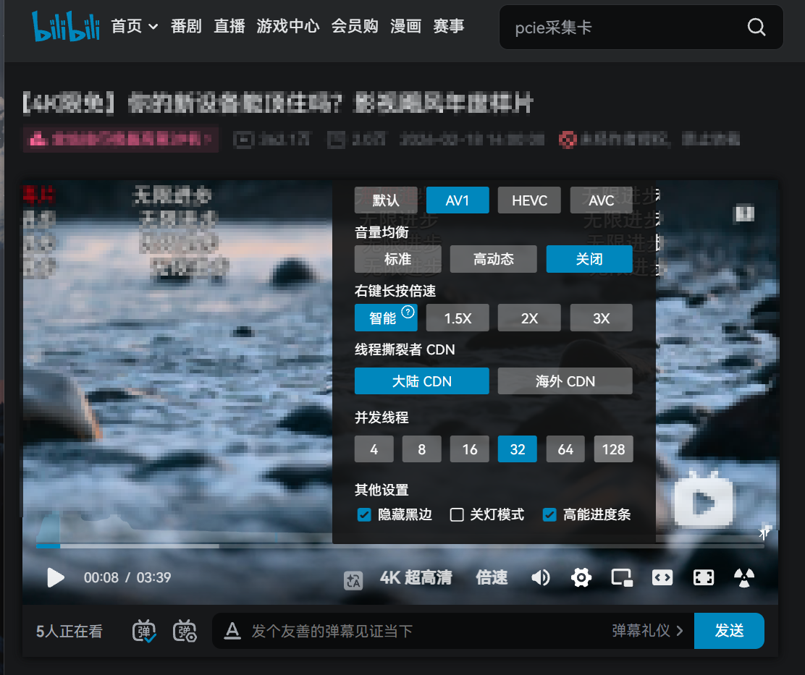

# Bilibili 线程撕裂者 海外加速

### 介绍

一个真的能解决海外用户B站卡顿的 Chrome 插件，实测即使冷门视频也能4K60帧不卡顿。本插件于澳大利亚墨尔本测试。本插件会 替换原本的播放器，同时从多个bilibili服务器加载 并且支持强制许选择国内服务器而不是海外CDN。



当前版本：`0.9.0.2`

> 免责：本项目是非官方、实验性质的开源扩展。它不会绕过会员、登录、区域、清晰度、审核状态、数字版权保护或媒体签名限制。

### 从发布页安装

1. 在项目发布页下载最新的扩展压缩包；
2. 将压缩包完整解压到固定目录，不要直接在压缩包里打开；
3. 在 Chrome 地址栏输入 `chrome://extensions`；
4. 打开右上角的“开发者模式”；
5. 点击“加载已解压的扩展程序”；
6. 选择解压后的扩展目录，该目录中应直接包含 `manifest.json`；
7. 刷新已经打开的哔哩哔哩视频页面。

### 从源码安装

克隆或下载源码后，可以直接在扩展管理页面选择项目根目录。

更新版本时，请在扩展管理页面点击“重新加载”，然后刷新视频页面。若旧版目录已经移动或删除，可以先移除旧版，再加载新版目录。

### 原理

很多海外用户的本地宽带并不慢，但观看哔哩哔哩时仍然会卡，尤其是冷门视频和四千分辨率视频。常见表现是普通测速很快，视频却只能缓慢缓存，播放一会儿就需要等待。

传统 CDN 优选插件通常只是测试几个节点，然后把视频地址换成其中一个：

```text
播放器 ── 单路下载 ── 一个优选节点
```

它本质上仍然是单路下载。遇到冷门视频时，即使换了节点，单连接速度也可能依旧很低，所以这种方案根本没有解决冷门视频的单路下载瓶颈。

线程撕裂者换了一种思路：把同一个媒体分段拆成多个字节块，同时下载，再按原顺序拼回去交给播放器。

由于海外节点慢，我们转变思路，推荐使用**国内的CDN+多线程**结合，这样既保证了速度又保证了视频缓存的概率大大增加。

```text
                 ┌─ 字节块 1 ─ 视频节点A
一个媒体分段 ────┼─   字节块 2 ─ 视频节点B
                 ├─ 字节块 3 ─ 视频节点C
                 └─ 字节块 4 ─ 视频节点D
                          ↓
                 按字节位置重新组合
                          ↓
                     交给播放器
```

## 安装方法

1- 解压 zip 文件到安全的地方

2- 在基于Chromium的浏览器中打开插件管理页 或 输入 chrome://extensions/

3- 打开开发者选项

4- 点击 加载未打包的扩展程序 选择解压后的文件夹

## 建议设置

播放器右下角的齿轮中可以修改节点模式和线程数。点击扩展图标可以打开常驻侧边栏，查看真实线程和下载速度。

| 使用情况                                 | 节点模式   | 建议线程数 |
| --- | --- | ---: |
| 日常使用 4K                              | 大陆节点   |         32 |
| 大陆节点无法稳定连接（你的运营商太烂了） | 海外节点   |         16 |
| 高码率4K分辨率视频仍然缓冲不足           | 较快的模式 |   可尝试64 |
| 设备性能较弱                             | 较快的模式 |          8 |

默认设置是大陆节点、`32` 线程。线程并非越多越快；如果 `32` 线程已经能够持续增加缓存，就没有必要直接调到 `128`。

如果没用就放弃吧，没救了

## 怎样判断是否已经生效

可以观察下面几个现象：

- 视频页会直接显示扩展播放器，不再先播放官方播放器再切换；
- 扩展图标上的数字在下载时大于零；
- 侧边栏出现视频线程、音频线程和各自速度；
- 播放器前方的缓存长度持续增加。

## 主要功能

- 把真实视频分段拆成多个字节区间并发下载，而不是只修改节点地址；
- 提供大陆节点和海外节点两种模式；
- 线程数可选 `4`、`8`、`16`、`32`、`64`、`128`；
- 线程数代表真实并发请求总上限，不会再乘以节点数量；
- 为慢请求保留救援线程，某个字节块卡住时可以换路线重试；
- 提供独立播放器，支持清晰度、进度、音量、倍速、画中画和全屏；
- 支持普通弹幕的读取、显示和发送；
- 侧边栏显示总速度、真实线程数和每条线程的节点；
- 工具栏图标实时显示当前在途线程数；
- 不主动上传播放记录、媒体数据或遥测信息。

## 常见问题

### 为什么打开视频后会短暂显示加载状态？

扩展会在页面开始加载时先遮住官方播放器，并直接建立自己的播放器。短暂的加载状态用于读取音视频索引、用小 Range 竞速可用节点，并准备首段连续缓存；它不再让官方播放器先播放几秒后突然替换。如果仍然看到官方播放器闪现，请在扩展管理页重新加载最新版并刷新视频页。

### 为什么大幅拖动进度条时会短暂重新加载？

如果目标位置尚未缓存，扩展会取消旧位置的 Range，并在目标时间建立一套干净的媒体缓冲区。这样可以避免把两个相距很远的 MP4 分段写进仍在更新的旧缓冲区。连续拖动会先合并为一次跳转，停下后再开始下载；已经缓存的位置则直接跳转。

### 为什么多线程可能比 CDN 优选更快？

CDN 优选解决的是“选哪一个节点”，多线程解决的是“怎样同时使用多条下载请求”。如果每条连接只能获得一部分速度，多条请求可以聚合出更高的总吞吐。

多线程不能创造不存在的带宽。如果所有节点最终都经过同一个拥堵的国际出口，提升仍然会比较有限。

### 扩展具体怎样下载视频？

哔哩哔哩的高画质视频通常把画面和声音分成两条轨道。扩展会：

1. 读取当前账号已经取得的播放清单；
2. 解析视频和音频的初始化区间与分段索引；
3. 先用一个很小的头部 Range 同时测试当前模式下的可用节点；
4. 复用最先返回的节点，以设置的线程数并行下载首段，其余节点作为快速备援；
5. 核对每个响应的起止位置、长度和文件总大小；
6. 已完成的首段子块按字节顺序持续写入媒体缓冲，不必等待整个大分段全部下载完；
7. 后续分段继续在后台并发下载，保持播放器前方的缓存长度。

每个字节块都必须先通过范围和长度校验，并且只能按原始顺序写入，避免错误内容造成花屏、解码失败或时间轴错乱。

### 为什么设置了三十二线程，侧边栏没有一直显示三十二？

设置值是最大并发数，不是必须长期占满的数量。媒体段较小、缓存已经足够、部分请求已经完成、视频暂停或正在等待下一段时，真实线程数都会下降。

线程显示为零也不一定是故障。页面还没有取得播放清单，或者当前没有正在传输的请求时，真实线程数本来就是零。

### 为什么开到一百二十八线程反而更慢？

连接建立、加密、调度和字节重组都需要开销，节点或网络设备还可能限制并发连接。通常应从十六或三十二开始，只在缓存速度确实不足时逐步提高。

### 哪些情况比较可能有效？

- 海外观看冷门视频或高码率视频；
- 单连接速度远低于本地宽带速度；
- 当前视频节点缓存较冷；
- 某些字节范围请求经常卡住；
- 不同视频节点到用户所在地的线路质量差异明显；
- 视频所需持续速度高于单连接能够提供的速度。

### 哪些情况改善有限？

- 用户宽带本身不足；
- 用户网络到所有视频节点共用同一个拥堵出口；
- 视频网页、评论或接口本身加载慢；
- 当前账号没有对应清晰度或视频的播放权限；
- 视频不是受支持的分段媒体格式；
- 哔哩哔哩修改了播放清单、播放器结构或接口。

### 为什么有些视频没有某个清晰度？

扩展只能使用当前账号和当前视频播放清单中已有、且浏览器能够解码的清晰度，不会生成不存在的画质。

### 扩展能解除地区、会员或登录限制吗？

不能。本项目只优化已经获得播放权限的媒体字节下载过程。

### 扩展会上传 Cookie、播放记录或视频内容吗？

不会。媒体字节只保存在当前页面内存和浏览器媒体缓冲区。发送弹幕只会在用户主动点击发送按钮后发生。

### 为什么需要这些网站权限？

- 页面脚本只注入哔哩哔哩网页；
- 弹幕域名权限用于读取当前视频的弹幕文件；
- 接口域名权限用于获取必要的视频信息，以及用户主动发送弹幕。

## 开发与构建

项目没有运行时包管理器依赖。播放器文件已经保存在 `vendor` 目录中。

```text
src/       多线程下载、节点选择、播放器和弹幕逻辑
popup/     扩展侧边栏界面
vendor/    第三方播放器文件与许可说明
icons/     扩展图标
scripts/   Windows 构建脚本
dev/       本地联调工具
```

在 Windows PowerShell 中构建：

```powershell
.\scripts\build.ps1
```

构建结果会写入 `dist`。扩展签名私钥位于本地 `private` 目录，已经通过仓库忽略规则排除，任何情况下都不应上传。

本地媒体联调需要自行提供测试视频编号和分段编号：

```powershell
$env:BTR_TEST_BVID="你用于测试的视频编号"
$env:BTR_TEST_CID="对应的分段编号"
node .\dev\server.js
```

## 反馈问题

提交问题时，建议附上 Chrome 版本、扩展版本、所在国家或地区、网络运营商、视频编号、清晰度、节点模式、线程数和侧边栏错误信息。

请不要公开 Cookie、访问令牌、完整签名地址或其他账号隐私信息。

## 第三方组件

播放器使用 ArtPlayer 和它的弹幕插件。具体版本、来源、文件校验值及许可证说明见 `vendor/THIRD_PARTY_NOTICES.md`。

## 开源协议

项目自身代码采用 [MIT 开源协议](LICENSE)。你可以使用、复制、修改和分发代码，也可以用于商业项目，但必须保留原始版权声明和许可证文本。第三方组件继续遵循各自的许可证。
