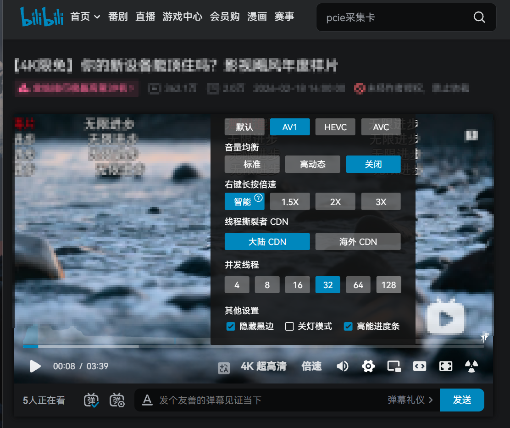
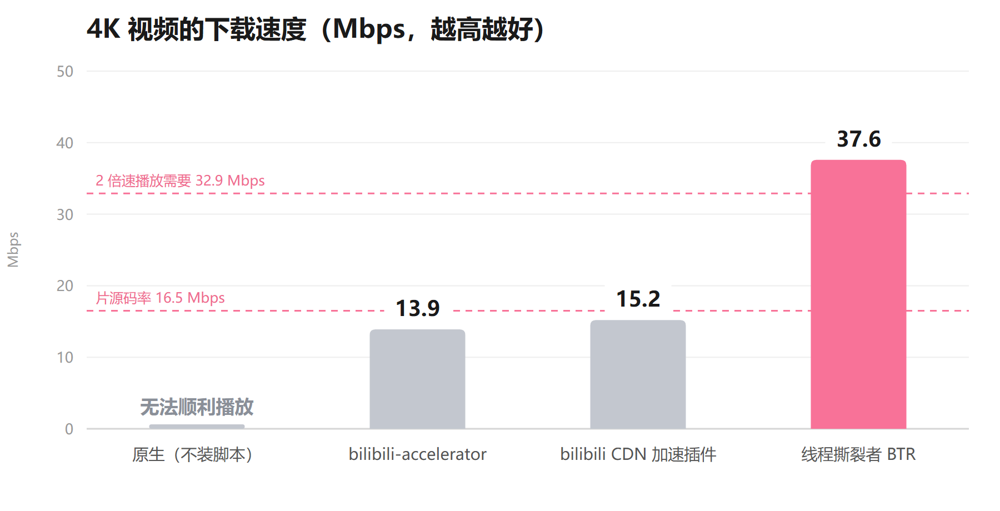
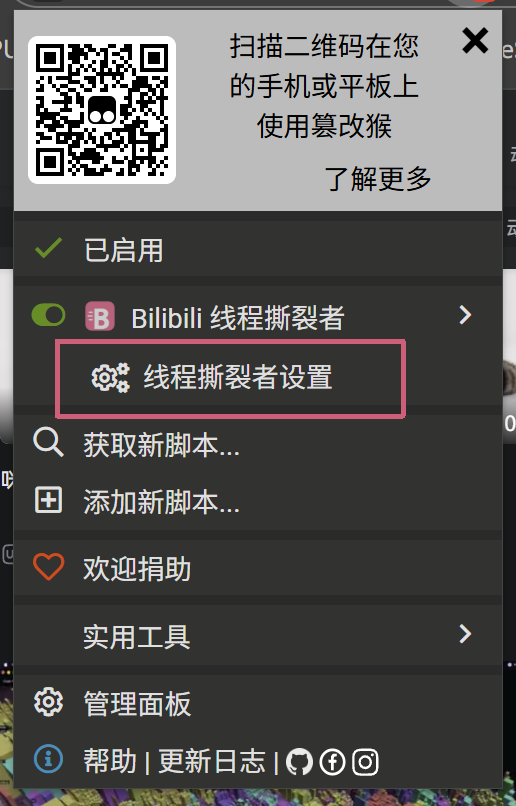
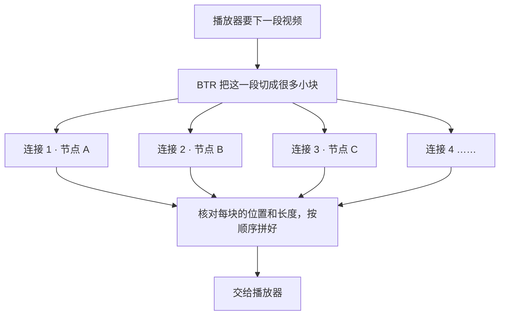
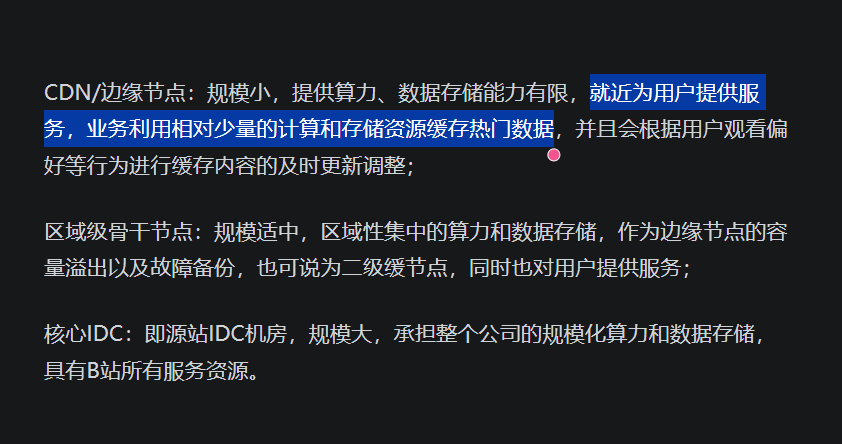

<div align="center">


# Bilibili 线程撕裂者

**一个真的能解决海外用户 B 站卡顿的油猴脚本**

通过多线程并发以及调度器优化实现海外 B 站 8K、杜比视界流畅播放

[](CHANGELOG.md) [](https://github.com/MrTangLuyao/Bilibili-thread-ripper/actions/workflows/tests.yml) [](https://github.com/MrTangLuyao/Bilibili-thread-ripper/stargazers) [](LICENSE)

[**安装**](#-安装) · [建议设置](#%EF%B8%8F-建议设置) · [原理](#-原理解释) · [常见问题](#-常见问题) · [反馈问题](#-反馈问题) · [更新日志](CHANGELOG.md)

 

</div>

> [!NOTE]
> 本项目是非官方、实验性质的开源项目。它不会绕过会员、登录、区域、清晰度、审核状态、数字版权保护或媒体签名限制。

> [!TIP]
> 如果 BTR 帮到了你，欢迎分享给同样在海外看 B 站的朋友，也可以给项目点个 Star ⭐，让更多人看到它。

## ✨ 为什么需要它

很多海外用户的宽带明明很快，打开 B 站热门视频也没什么问题，但是一到冷门视频、4K、4K 60 帧就开始卡。传统 CDN 优选插件只是换一个节点，换完以后本质上还是单连接下载，碰到冷门资源或者单连接限速，照样该卡就卡。

线程撕裂者不再赌某一个 CDN。它会把 B 站的视频分段继续拆成多个字节块，像 IDM 一样并发下载，下载完成后按原顺序交给播放器。

- **多线程并发**：一段视频拆成很多小块，多条连接、多个节点一起下，核对无误再按顺序交给播放器
- **大陆 CDN 直连**：冷门视频不在海外没缓存的边缘节点上干等，直接去大陆节点拿数据
- **为播放服务的调度**：实时测每个节点的速度，自动决定线程数；断了接着下，快要播的内容先下
- **原生播放器不变**：清晰度、弹幕、字幕、倍速、分 P 都还是 B 站自己的
- **直播加速**（实验性）：屏蔽直播 P2P，分片在多个官方节点之间竞速
- **不上传任何数据**：没有遥测，媒体数据只进当前页面的内存和浏览器缓冲区

### 速度对比

<div align="center">

</div>

<sub>墨尔本，运营商 Superloop 实测。测试视频是一个仅自己可见、几乎无播放的杜比视界 4K60 视频（BV1Aou3zjEh1），5 次测试取平均，仅供参考。</sub>

## 📦 安装

> 📺 不会装？看 [视频安装步骤](https://www.bilibili.com/video/BV1Teec6BE3s)（参考 2P，通过油猴脚本安装）

1. 安装脚本管理器：[暴力猴 Violentmonkey](https://violentmonkey.github.io/)（推荐）或 [Tampermonkey](https://www.tampermonkey.net/)。部分用户反馈 Tampermonkey 正式版有时接管不稳定，换 beta 版可以解决。
2. **Chrome、Edge 等 Chromium 内核浏览器必做**：扩展管理 → 暴力猴（或 Tampermonkey）→ 详情 → 打开 **允许运行用户脚本**（老版本是打开“开发者模式”）。

   

3. 点这里安装：

   [](https://raw.githubusercontent.com/MrTangLuyao/Bilibili-thread-ripper/main/user_scripts/bilibili-thread-ripper.user.js)

4. 打开任意 B 站视频，页面上出现 BTR 悬浮球就装好了。以后有新版会自动更新，看到更新弹窗点“更新”即可。

| 浏览器 | 支持 | 建议 | 说明 |
| --- | :---: | --- | --- |
| Chrome、Edge 等 Chromium 内核 | ✅ | [暴力猴插件](https://violentmonkey.github.io/) | 一定要打开“允许运行用户脚本” |
| Firefox | ✅ | [暴力猴插件](https://violentmonkey.github.io/) | |
| Safari | ✅ | [Tampermonkey](https://www.tampermonkey.net/) | 建议在设置里选择兼容模式 |

> [!WARNING]
> 如果你是早期通过视频了解到这个插件的：针对 Chrome 的独立插件版已经停止更新。请先在扩展管理里移除插件版，再按上面的步骤安装油猴脚本版，不要同时开启两个版本。

## ⚙️ 建议设置

下面只是参考，每个人的网络差别很大，最后以你自己看着顺不顺为准：

| 情况 | CDN 模式 | 线程数 |
| --- | --- | ---: |
| ⭐ 推荐 | 大陆 CDN | 自动 |
| 手动调优 | 大陆 CDN | 8 到 32 |
| 设备性能弱 | 大陆 CDN | 4 到 8 |
| 本地连大陆网络太差 | 海外 CDN | 自动 |

**设置在哪里**，三个入口都可以：

- B 站任意页面上的 **BTR 悬浮球**
- 脚本管理器菜单：暴力猴（或 Tampermonkey）→ **线程撕裂者设置**
- 播放器里：⚙ → **更多播放设置**

<table>
  <tr>
    <td align="center"><br><sub>BTR 悬浮球</sub></td>
    <td align="center"><br><sub>Tampermonkey 菜单</sub></td>
    <td align="center"><br><sub>暴力猴菜单</sub></td>
  </tr>
</table>

**自定义 CDN**：除了大陆和海外，还可以选“自定义”：勾选已知的服务器，或者手动添加 B 站的视频服务器地址（bilivideo.com、akamaized.net 等），插件只用你选的这些。一个都没选时按大陆 CDN 下载。

**面板主题**：设置面板标题右边、GitHub 图标旁的按钮切换主题：☀️ 浅色、🌙 深色，右下角带个小 A 的是自动（跟随系统配色，默认）。每点一下换一种：自动 → 跟系统相反的颜色 → 跟系统相同的颜色 → 自动。选择会保存，并通过同一个脚本管理器在 B 站各个页面和标签页之间同步。

## 🔍 怎么知道它在工作

- 设置面板会显示**目前总线程**。偶尔显示 `0` 是正常的，说明当前已经缓冲了足够的内容。
- 播放器右键 **视频统计信息** 里的节点、速度和分段是插件实际的下载数据，Player Type 一行会写 `BTR Native`。
- 播放器前方的缓存持续增长，说明下载的数据正在正常交给播放器。

## 🧠 原理解释

### 多线程思想

B 站网页播放器下视频，一段数据只开一条连接。海外看冷门视频时这条连接经常只有几 Mbps，码率一高就卡。BTR 把这一段再切成很多小块，分给多条连接、多个节点一起下，下完核对位置，再按顺序拼起来交给播放器。


```mermaid
flowchart TD
    A["播放器要下一段视频"] --> B["BTR 把这一段切成很多小块"]
    B --> C1["连接 1 · 节点 A"] & C2["连接 2 · 节点 B"] & C3["连接 3 · 节点 C"] & C4["连接 4 ……"]
    C1 & C2 & C3 & C4 --> D["核对每块的位置和长度，按顺序拼好"]
    D --> E["交给播放器"]
```

每条连接下的是文件里不同的部分，不会把同一个文件下好几遍。哪一块回来的位置或长度不对，直接丢掉，不会塞进播放器。

全接管模式下，BTR 直接把数据写进网页里的播放器，B 站的界面、弹幕、清晰度菜单都照常用；兼容模式下还是 B 站播放器自己放，BTR 只帮它下载。

### 为什么用大陆 CDN

B 站官方在 [《B站公网架构实践及演进》](https://www.bilibili.com/opus/740129406252482739) 里讲过他们的 CDN 分层，下面是原文截图：

<div align="center">

</div>

边缘节点离你近但容量小，只缓存热门视频；区域节点容量大，给边缘节点兜底；核心机房存着所有视频。所以海外看热门视频很快，冷门视频在海外边缘节点上没有缓存，要绕回国内去取，一条连接就慢得不行。这是按官方架构推出来的，不代表每个视频、每条线路都这样。

大陆 CDN 模式就是直接去大陆节点拿数据，不在海外没缓存的节点上干等。大陆离得远，单条连接还是慢，所以要和多线程一起用。

普通的 CDN 优选插件是测几个节点、挑最快的那个，但下载还是一条连接，冷门视频照样卡。BTR 也变不出带宽：宽带本身跑不动这个码率，或者所有节点都堵在同一个出口，线程再多也没用。

<details>
<summary><b>多线程下载调度：不只是多开几个线程</b></summary>

线程撕裂者不是简单地把一个视频开很多线程下载，而是在多个 CDN 之间做了一套为播放服务的调度。

早期线程撕裂者由于效率低，采用堆砌线程方法来提升速度，随着版本优化，最新的线程撕裂者的内核更接近于下载调度器。它会一直测每个 CDN 的实际速度、响应时间和稳定性，据此决定开多少线程、每个节点分多少数据、每块切多大。某一块中途断了，就从已经下到的位置接着下，不用整块重来。离播放越近的数据越先下，带宽先留给马上要播的内容；只有判断某个请求可能赶不上播放时，才会找别的节点再发一份去救，尽量不浪费流量。

另外它还会管浏览器缓冲区的容量和下载地址的签名过期；出问题的 CDN 先降级，过一会儿再重新试；接管时让 B 站自己的下载调度器停下来，免得两边重复下载。直播里则是节点竞速加限流预取，把快要播的分片提前准备好。

</details>

<details>
<summary><b>直播加速（实验性）</b></summary>

BTR 的直播加速刚刚开始适配，还在探索中，效果可能有限，没有视频那么明显。后期有优化空间会优化。

`0.9.4.0` 起，live.bilibili.com 的直播间也由插件接管下载（设置里可以单独关掉）。直播和点播的卡顿原因不一样：直播分片是一秒一片实时产生的，没法像点播那样往前猛下，但是海外分到的直播节点质量参差、经常波动，网页播放器还会开 P2P 从其他观众那里拉数据，海外观众稀少时反而更卡。所以直播模块做的是：

- 屏蔽直播 P2P 和 PCDN 中转，只走官方节点；
- 每个分片在多个官方节点之间竞速，慢了 0.4 秒就开备份副本，坏节点整场停用；
- 提前下载 playlist 里已经宣告的分片，播放器来取的时候直接给，实测分片等待时间中位数可以降到 0。

直播只处理 fMP4 HLS 流（网页播放器默认使用的格式）。

</details>

## 🎬 和 B 站播放器的分工

`0.9.x` 起使用 B 站原生播放器界面，不再自己重复造一套播放器。播放器功能归播放器，加速功能归线程撕裂者，少互相干扰：

| B 站播放器继续负责 | 线程撕裂者只负责 |
| --- | --- |
| 清晰度和编码选择 | 媒体下载 |
| 弹幕显示、发送和弹幕设置 | CDN 路线 |
| 字幕、自动生成字幕和字幕切换 | 并发 Range |
| 倍速、音量、画中画和全屏 | 缓冲 |
| 合集、分 P、自动连播和站内切换 | 失败重试 |
| B 站自己的快捷键与播放器设置 | |

## ❓ 常见问题

**效果明不明显，主要看你属于哪种情况：**

| ✅ 提升比较明显 | ❌ 解决不了 |
| --- | --- |
| 海外观看冷门视频、4K 或高码率视频 | 你的宽带本身就跑不动当前码率 |
| 普通测速很快，但是 B 站单连接速度很低 | 所有节点共用同一个拥堵出口 |
| 某些媒体 Range 经常卡住 | B 站网页、评论区或者接口本身加载慢 |
| 不同 CDN 到你所在地的线路质量差异很大 | 当前账号没有播放权限 |
| 原生播放器的下载速度长期低于视频实际码率 | B 站修改了播放器结构或者媒体接口 |

<details>
<summary><b>能不能解除地区、会员或者登录限制？</b></summary>

不能。线程撕裂者只会优化你已经有权访问的媒体字节，不负责绕过任何播放权限。

</details>

<details>
<summary><b>全接管和兼容模式是什么意思？</b></summary>

对于普通用户，建议开启全接管模式；一个例外是 Safari 用户，建议开启兼容模式以避免一些播放问题。

全接管模式会接管更多的播放器底层功能，自己重写了部分播放器的底层运行模式。如果遇到了任何播放问题，比如跳帧、部分设置不生效，建议开启兼容模式：这个模式下会更少地改写 B 站的播放器，而是让 BTR 的底层去适配 B 站的播放器。

如果你是桌面版 BTR 的用户，则没有这个选项：桌面版强制工作在类似网页版兼容模式的方式下，这是为了更好的版本兼容性。

</details>

<details>
<summary><b>为什么设置 32 线程却没有一直显示 32？</b></summary>

`32` 是并发上限，不是要求插件每一秒都塞满 32 条连接。媒体分段较小、缓存足够、请求刚完成或者音视频任务数量变化时，真实线程数都会下降。

</details>

<details>
<summary><b>为什么第一次打开视频可能比热门视频原生起播慢一点？</b></summary>

这个问题在兼容模式和桌面版的部分视频中更明显，但我相信这是值得的。插件要先读取音视频索引、确认可用节点并准备一段连续缓存。这个过程会有额外开销，目的是避免高码率视频刚播两秒就开始转圈。

</details>

<details>
<summary><b>自动播放开关失效？</b></summary>

这个 Bug 已经在最新版本中修复，如果是旧版用户记得更新。但是部分用户依旧反馈会出现。如果你在最新版中依旧遇到这个问题，解决办法是在设置中打开兼容模式。

</details>

<details>
<summary><b>直播加速开启后感觉更卡了？</b></summary>

目前直播加速在早期实验阶段，不如视频加速成熟，我们依旧在探索如何更好地加速直播。如果出现这种情况，建议关闭直播加速。

</details>

<details>
<summary><b>播放视频时，右键统计信息里的数据很奇怪？</b></summary>

这是正常的。由于接管了播放器的一些东西，导致统计信息异常，我会逐步解决这个问题。

</details>

<details>
<summary><b>会不会上传 Cookie、播放记录或者视频内容？</b></summary>

不会。插件不提供遥测服务，也不会把视频内容上传到第三方服务器。媒体数据只进入当前页面的内存和浏览器媒体缓冲区。

</details>

<details>
<summary><b>未来会提供手机或平板版吗？</b></summary>

目前的结论是，为手机开发非侵入式的 BTR 很难。通过 Loon、圈X、Clash 去改写手机 B 站的优化效果有限；可行的方案比如魔改 B 站客户端或第三方客户端，即使能开发出来，安装与维护的难度也很大。所以暂时不开发 BTR 手机版，但是本项目欢迎各路大神移植手机。

</details>

## 🐞 反馈问题

只说一句“没效果”，基本没办法判断到底是节点、带宽、编码、权限还是插件出错。如果你要反馈“还是卡”，最好一起提供这些信息：

- [ ] 浏览器和暴力猴（或 Tampermonkey）的版本，BTR 的版本
- [ ] 所在国家或地区，以及网络运营商
- [ ] 视频 BV 号、清晰度和编码
- [ ] CDN 模式与线程数
- [ ] 右键“视频统计信息”里的数据，打开 Debug 后的日志或错误提示；也可以在浏览器控制台运行 `copy(__biliThreadRipperDebug.report())`，把复制下来的诊断信息贴上来
- [ ] 是首次加载慢、连续播放卡，还是大幅拖动后卡

> [!CAUTION]
> 请不要公开 Cookie、访问令牌或者完整的媒体签名地址。

## 🛠️ 开发与构建

项目运行和构建没有任何依赖。单元测试只需要 Node.js，浏览器测试还需要 Playwright 和浏览器。

<details>
<summary><b>目录结构、构建、测试和发版</b></summary>

```text
src/          原生播放器接管、多线程下载、Range 校验、CDN 选择和设置面板
user_scripts/ 油猴脚本（发版时生成）和它的适配层；adapter/meta.json 是脚本头和打包顺序
scripts/      构建和发版脚本
dev/          本地测试
icons/        脚本图标
```

- **构建**：`node scripts/build.mjs`（或 `npm run build`），生成 `dist/bilibili-thread-ripper.user.js`，版本号用最近一个 tag。想在自己浏览器里试，就在 Tampermonkey 里新建一个脚本，把这个文件的内容整个贴进去保存。
- **测试**：`node dev/run-tests.js`（或 `npm test`）。浏览器测试要用 Playwright（可通过 `NODE_PATH` 指向它所在的 node_modules），默认使用 `playwright install chromium` 安装的 Chromium，Windows、Linux、macOS 使用相同入口；Linux 可用 `playwright install --with-deps chromium` 安装系统依赖。要使用已安装的 Chrome，可设置 `BTR_CHROME_PATH` 为其可执行文件的完整路径。
- **发版**：先把改动写进 `CHANGELOG.md` 最上面的 `## [Unreleased]`，然后在 main 上运行 `node scripts/release.mjs`（或 `npm run release`）。它会算出今天的版本号、改好 CHANGELOG、构建 `user_scripts/bilibili-thread-ripper.user.js`、跑测试、提交并打 tag，最后打印推送命令。推送要自己来，推到 main 就等于发给所有用户。

源码里的版本号都写成 `__BTR_VERSION__`，构建时才换成真实版本，不要手改。`src/` 里的 range-core、cdn-resolver、idm-downloader、notification-view、runtime-notices 这 5 个文件桌面版也在用，改了要同步过去。

</details>

## 🤝 参与贡献

我个人能力有限，由衷希望各路大佬都来贡献代码、提提意见，我都会看的。希望有朝一日 B 站能优化好海外的 CDN，我们也不用搞这么多复杂的玩意了。

<a href="https://github.com/MrTangLuyao/Bilibili-thread-ripper/graphs/contributors">
  
</a>

## 📄 开源协议

项目采用 [MIT 开源协议](LICENSE)。你可以使用、复制、修改和分发，也可以用于商业项目，但必须保留原始版权声明和许可证文本。
